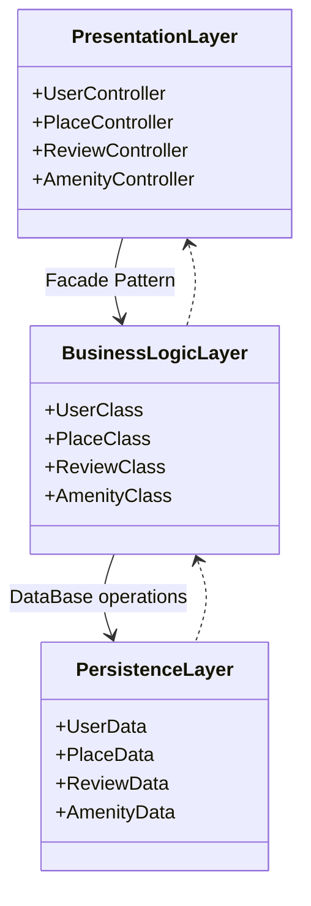
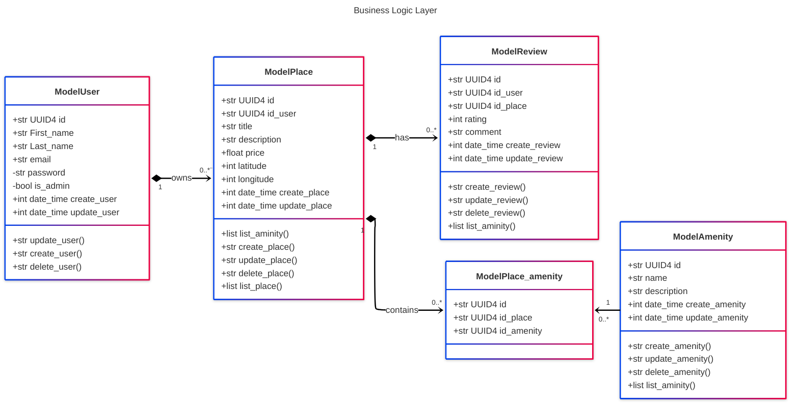
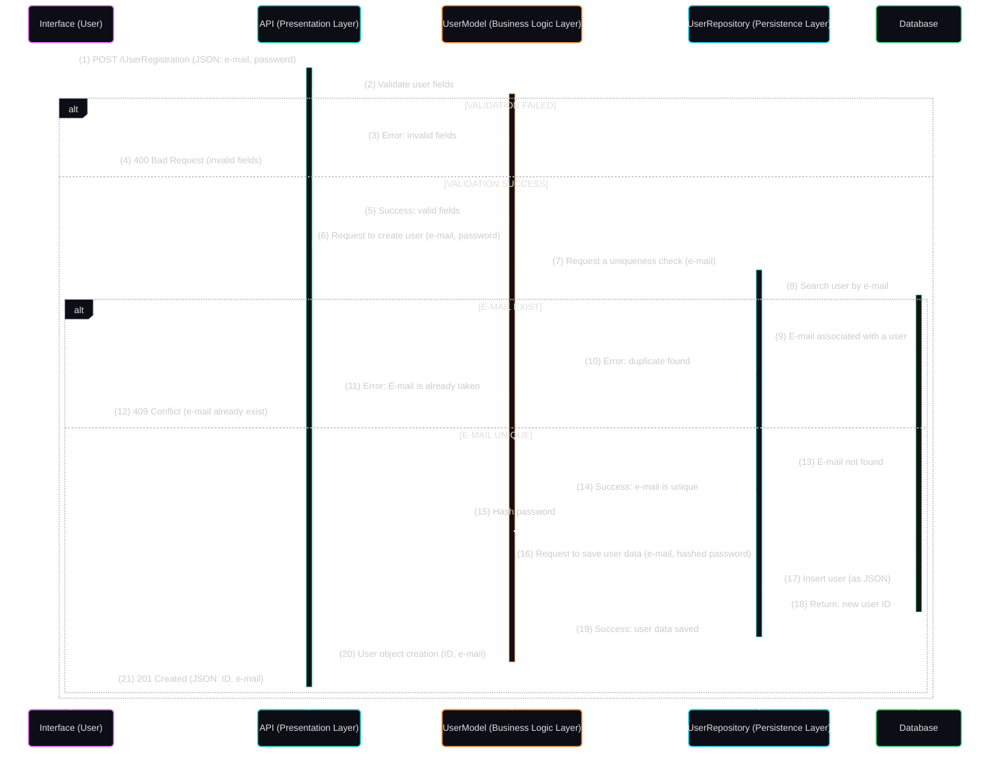
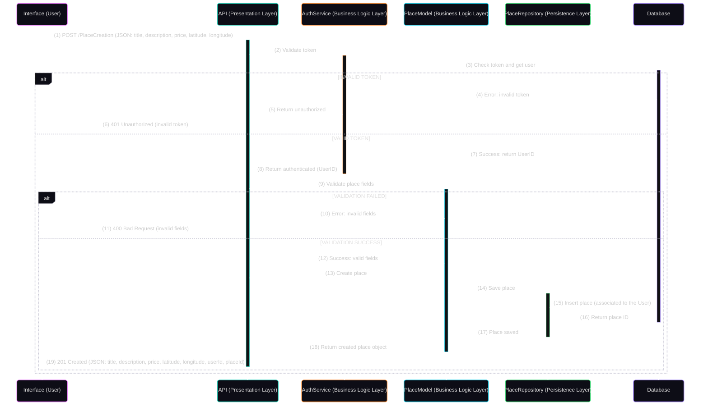
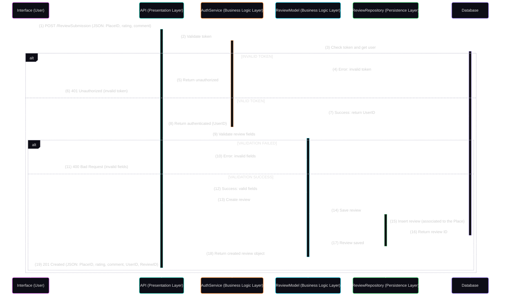
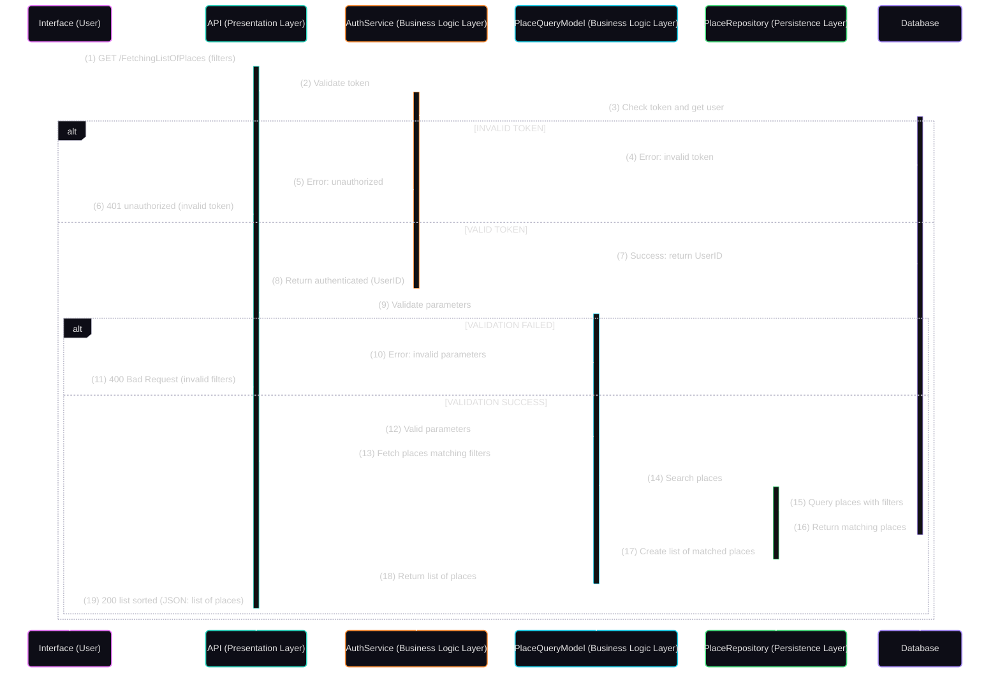

# HBnB - UML Design Documentation

## Table of Contents
- [Project Overview](#project-overview)
- [Architecture Overview](#architecture-overview)
- [High-Level Package Diagram](#high-level-package-diagram)
- [Business Logic Layer](#business-logic-layer)
- [Entity Relationships](#entity-relationships)
- [Business Rules](#business-rules)
- [Design Decisions](#design-decisions)

## Project Overview
This project contains comprehensive UML documentation for the HBnB (Holberton Airbnb) application. These diagrams serve as architectural blueprints before development begins and ensure consistency across database design and business logic implementation.

## Architecture Overview
The HBnB application follows a layered architecture pattern with clear separation of concerns:
- **Presentation Layer**: User interface and API endpoints
- **Business Logic Layer**: Core entities and business rules
- **Data Access Layer**: Database operations and persistence

## High-Level Package Diagram

## Business Logic Layer

### Overview
The business logic layer contains the core domain entities that represent the fundamental concepts of our rental platform.

### Core Entities

#### User (ModelUser)
Represents platform users who can list properties and write reviews.
- **Key Attributes**: Unique identifier, personal information, authentication data
- **Capabilities**: Create, update, and delete user profiles
- **Security**: Password is private, admin status controls access levels

#### Place (ModelPlace)
Represents user feedback and ratings for places.
- **Key Attributes**: Rating (numeric), written comment, timestamps
- **Relationships**: Written by a User about a specific Place
- **Business Rule**: Must be associated with both a User and a Place

#### Amenity (ModelAmenity)
Represents facilities and services available at places.
- **Key Attributes**: Name, description, management timestamps
- **Relationship**: Many-to-many with Places through Place_amenity

#### Place_amenity (ModelPlace_amenity)
Junction table managing the manu-to-many relationship between Places and Amenities.

### Class Diagram

## Entity Relationships

### Relationship Details
- **User -> Place**: One-to-Many (1:0..*)
  - A user can own multiple properties
  - Each place must have exactly one owner

- **Place -> Review**: One-to-Many (1:0..*)
  - A Place can have multiple reviews
  - Each review belongs to exactly one place

- **User -> Review**: One-to_Many (1:0..*)
  - A user can write multiple reviews
  - Each review is written by exactly one user

- **Place <-> Amenity**: Many-toMany (via Place_amenity)
  - Places can have multiple amenities
  - Amenities can be shared across multiple palces

## Business Rules

### Data Integrity Constraints
1. **Referential Integrity**: All Foreign key relationships must be maintained
2. **User Dependency**: Places and Reviews cannot exist without valid User references
3. **Place Dependency**: Reviews cannot exist without valid Place references

### Business Logic Rules
1. **Authentication Required**: Only authenticated users can create places or reviews
2. **Ownership Rights**: Only place owners can modify their property details
3. **Review Limitations**: Users cannot review their own properties
4. **Amenity Reusability**: Amenities are shared resources across the platform

## Design Decisions

### Identifier Strategy
- **UUID4**: Used for all primary keys ro ensure global uniqueness and security
- **Benefits**: Prevents enumeration attacks, enables distributed systems

### Identifier Strategy
- **UUID4**: Used for all primary keys to ensure global uniqueness and security
- **Benefits**: Prevents enumeration attacks, enables distributed systems

### Timestamp Management
- **Automatic Timestamps**: Creation and update times are system-managed
- **Consistency**: All entities follow the same temporal tracking pattern

### Data Types
- **Coordinates**: Integer type for latitude/longitude (consider decimal precision needs)
- **Pricing**: Float type for monetary values (consider precision requirements)
- **Ratings**: Integer type for simplicity (1-5 scale assumed)

## Future Considerations
- Consider adding validation rules for ratings (1-5 range)
- Evaluate coordinate precision requirements for mapping accuracy
- Plan for soft delete functionality to maintain data history
- Consider adding audit trails for sensitive operations

## Conventions Used
- **Naming**: snake_case for attributes, PascalCase for classes
- **Visibility**: + (public), - (private) indicators
- **Prefixes**: "Model" prefix for all entity classes
- **Methods**: CRUD operations follow consistent naming patterns

## Sequence Diagrams for API Calls

### User Registration

This sequence diagram illustrates the steps of the user registration process:

1. **Request Submission**: The user provides their email and password
2. **Data Validation**: The system verifies the compliance of the information entered
3. **Uniqueness Verification**: The system ensures the email isn't already in use
4. **Security**: For unique emails, the password is hashed before storage
5. **Persistence**: The user data is saved in the database
6. **Confirmation**: The system responds with the ID and email of the new user

Key aspects of this process:
- Preliminary validation of data before any database operation
- Verification of email uniqueness to avoid duplicates
- Password protection through hashing
- Return of only non-sensitive data in the response (ID and email)
- Clear HTTP codes indicating success (201) or reasons for failure (400, 409)

This flow implements multiple layers of protection to ensure user data integrity.

### Place Creation

This sequence diagram illustrates how an authenticated user creates a new place listing:

1. **Request Submission**: User submits place details (title, description, price, location)
2. **Authentication**: System validates the user's identity through token verification
3. **Data Validation**: Place details are validated against business rules
4. **Persistence**: Valid place data is stored in the database with user association
5. **Confirmation**: System responds with the newly created place details

Key aspects of this flow:
- Authentication verification occurs before any business logic processing
- Input validation ensures data integrity before persistence
- User-place relationship is established in the database
- Response includes both the place data and its unique identifier
- Clear HTTP status codes indicate success (201) or specific failure reasons (400, 401)

This flow enforces the "Authentication Required" business rule by ensuring only verified users can create place listings.

### Review Submission

This sequence diagram illustrates how an authenticated user submits a review for a place:

1. **Request Submission**: User submits review details (place ID, rating, comment)
2. **Authentication**: System validates the user's identity through token verification
3. **Data Validation**: Review content is validated against business rules
4. **Persistence**: Valid review data is stored in the database with user and place associations
5. **Confirmation**: System responds with the newly created review details

Key aspects of this flow:
- Authentication verification occurs before any business logic processing
- Input validation ensures review data meets quality standards
- Both user-review and place-review relationships are established in the database
- Response includes the complete review data with all relevant identifiers
- Clear HTTP status codes indicate success (201) or specific failure reasons (400, 401)

This flow enforces both the "Authentication Required" business rule and establishes the necessary relationships required by the data integrity constraints.

### Fetching a List of Places

This sequence diagram illustrates how an authenticated user fetches a filtered list of places:

1. **Request Submission**: User submits a request with optional filter parameters
2. **Authentication**: System validates the user's identity through token verification
3. **Parameter Validation**: Filter parameters are validated for correctness
4. **Data Retrieval**: System queries the database for places matching the filters
5. **Results Processing**: Matching places are collected and sorted according to criteria
6. **Confirmation**: System responds with the sorted list of places

Key aspects of this flow:
- Authentication verification ensures only authorized users can access listing data
- Parameter validation prevents invalid database queries
- Filtering capabilities enable users to find relevant properties
- Sorting functionality improves user experience and data organization
- Response includes complete listing information in a structured format
- Clear HTTP status codes indicate success (200) or specific failure reasons (400, 401)

This flow supports the core functionality of browsing available properties while maintaining system security through proper authentication.

## Author

**Lucas Boyadjian**
GitHub: [@Lucas-Boyadjian](https://github.com/Yadjian)